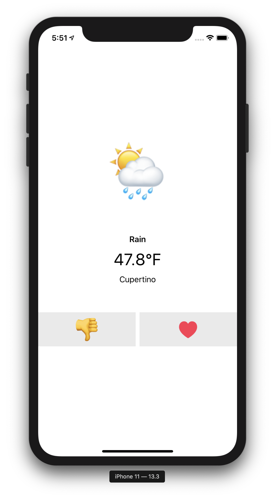
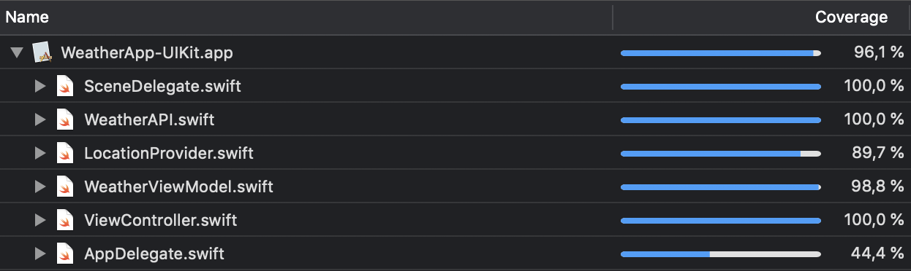
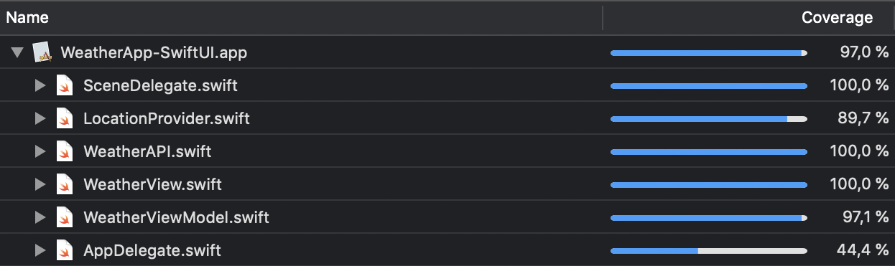

# WeatherApp Examples: RxSwift+UIKit vs. Combine+SwiftUI

---

This repository contains example apps from my talk [
Testing SwiftUI and Combine: The State of the Art](https://2020.iosconf.sg/schedule/#session-207).

---

    

This repo contains **two funcionaly identical implementations** of a simple weather app. Both implementations are properly tested.

<table>
    <thead>
        <tr>
            <th><h3>RxSwift+UIKit</h3></th>
            <th><h3>Combine+SwiftUI</h3></th>
        </tr>
    </thead>
    <tbody>
        <tr>
            <td></td>
            <td> </td>
        </tr>
        <tr>
            <td colspan=2><strong>Technology:</strong></td>
        </tr>
        <tr>
            <td>
                <ul>
                    <li>MVVM</li>
                    <li><a href="https://github.com/ReactiveX/RxSwift">RxSwift</a></li>
                    <li>UIKit (with Storyboards)</li>
                </ul>
            </td>
            <td>
                <ul>
                    <li>MVVM</li>
                    <li>Combine</li>
                    <li>SwiftUI</li>
                </ul>
            </td>
        </tr>
        <tr>
            <td colspan=2><strong>Test tools:</strong></td>
        </tr>
        <tr>
            <td>
                <ul>
                    <li>XCTest</li>
                    <li><a href="https://github.com/ReactiveX/RxSwift/blob/master/Documentation/UnitTests.md">RxBlocking + RxTest</a></li>
                </ul>
            </td>
            <td>
                <ul>
                    <li>XCTest</li>
                    <li><a href="https://github.com/industrialbinaries/CombineTestExtensions">CombineTestExtensions</a></li>
                    <li><a href="https://github.com/kif-framework/KIF">KIFF (selected classes)</a></li>
                </ul>
            </td>
        </tr>
    </tbody>
</table>

## License and Credits

Code in this repo is released under the MIT license. See [LICENSE](https://github.com/industrialbinaries/CombineTestExtensions/blob/master/LICENSE) for details.

Created by [Vojta Stavik](https://twitter.com/vojtastavik) @ [Industrial Binaries](https://industrial-binaries.co).
